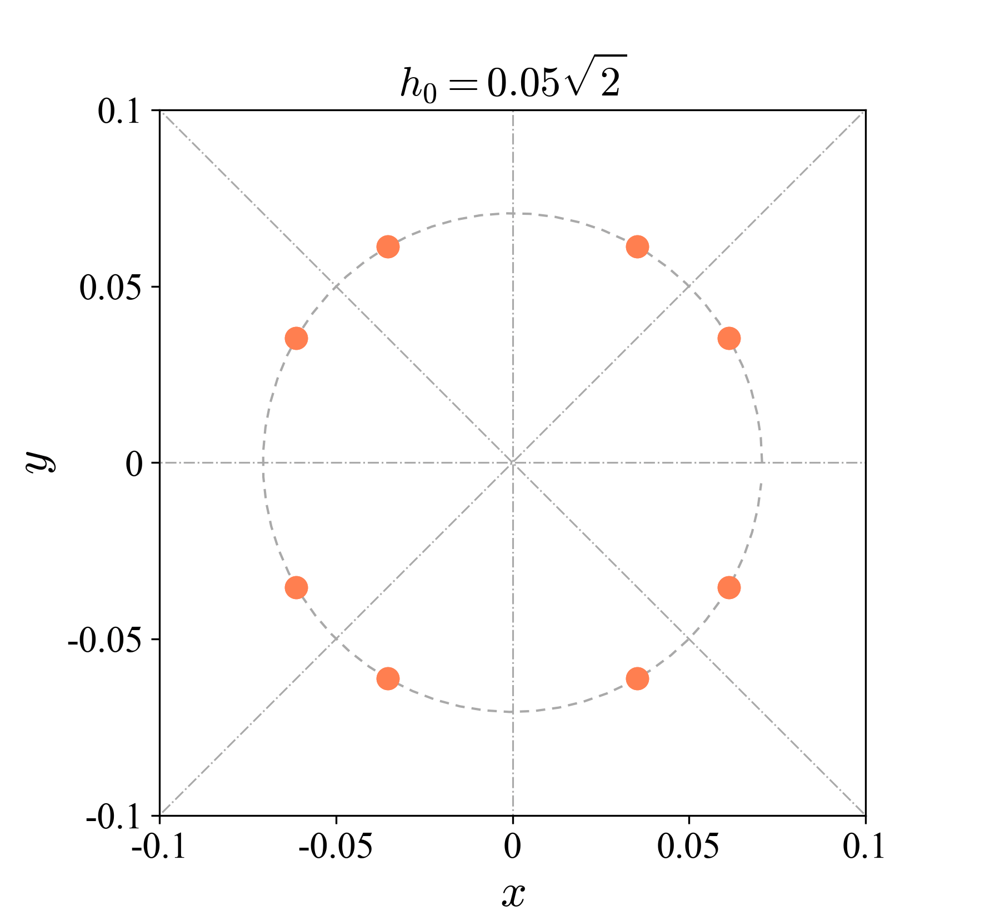
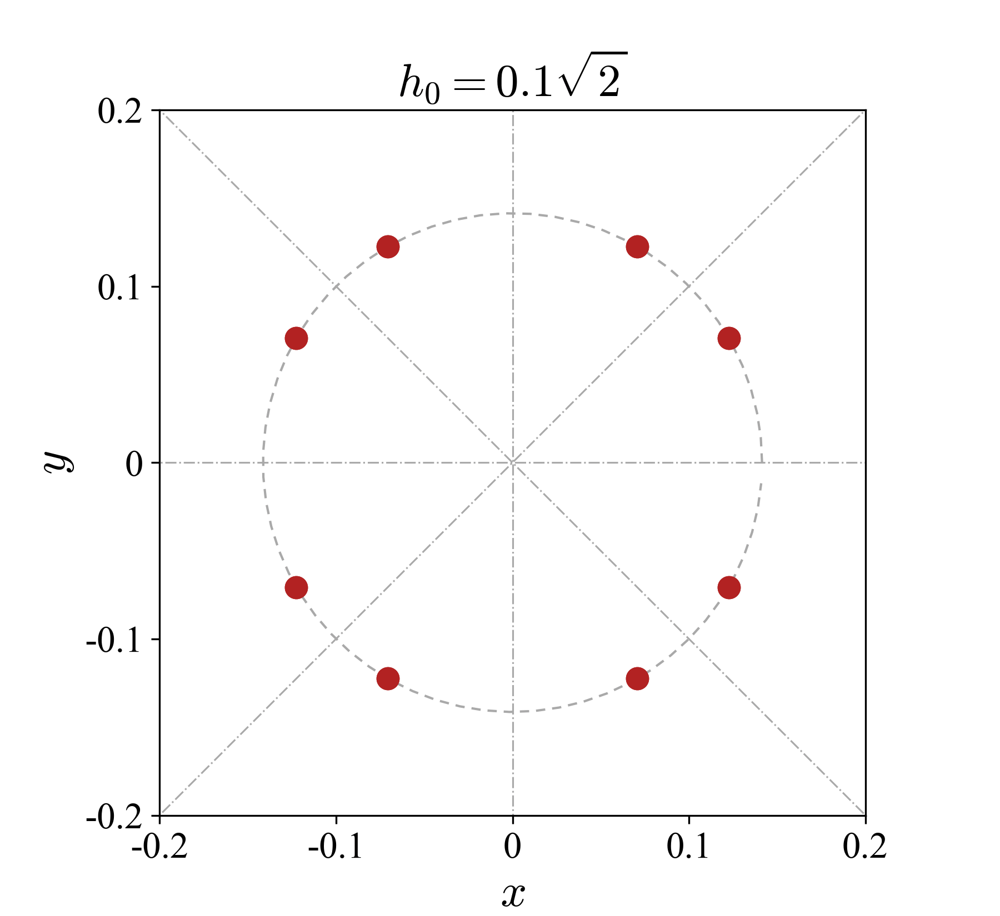
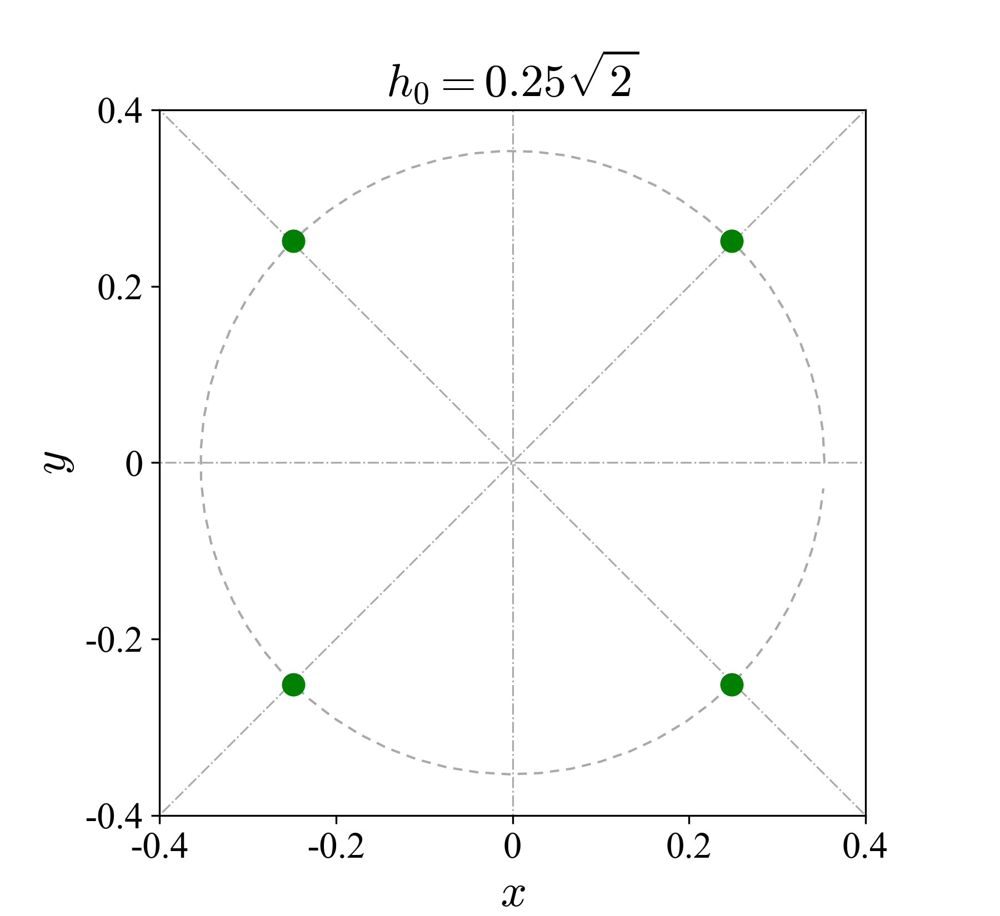
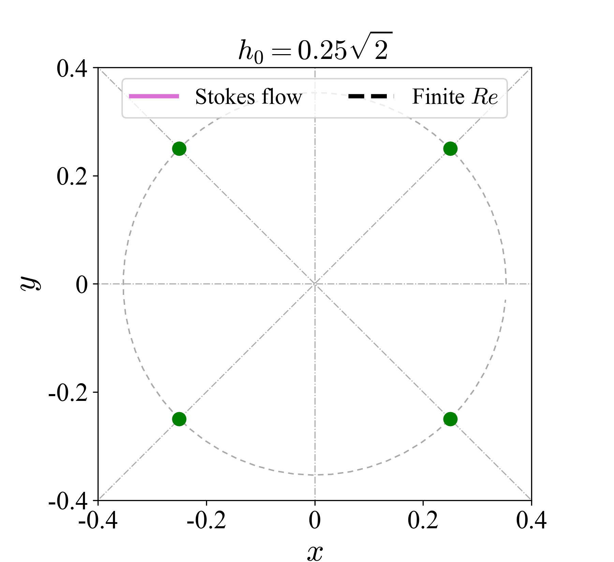

# RL_control_FRM
This repo is to demonstrate applying reinforcement learning (RL) based control to steer a droplet back to the origin in a fluid system called four-roll mill (FRM). The flow environment is based on an open-source CFD package [Nek5000]. The RL algorithm is proximal policy optimization (PPO) based on [PyTorch].

Two different flow regimes are considered: the first with a finite Reynolds number, exhibiting moderate inertial effects; the second with a vanishingly small Reynolds number, where inertial effects are negligible. For the first case, the input state to the agent includes the current position, velocity, and acceleration of the droplet. For the second case, the input state comprises only the position.

## Installation
- python3 and pip3: `sudo apt install python3-pip`
- pytorch: `pip3 install pytorch`
- Nek5000: see the description [here](https://nek5000.github.io/NekDoc/quickstart.html)

## How to train the policy
There are two cases called finite Re (Fin) and vanishing small Re (Van). Suppose we wish to run finite Re case.

- Go to the directory _Fin_: `cd Fin`
- Complie the CFD code in folder _CFD_: `makenek FRM`
- Train the control policy for one of the initial positions such as _r025_: `python train.py`

## How to test the policy

- Copy the saved_models and change its name : `cp -r saved_models new_name`
- Test the control performance: `python test.py`

## Well-trained example policies
We have provided well-trained models for each cases under corresponding directories. 

- To verify them, go to the directory of a wanted initial conidition such as _Fin/r025_: `python test.py`

## Controlled trajectories

The following shows the successfully controlled trajectores.

  
  
  
  

